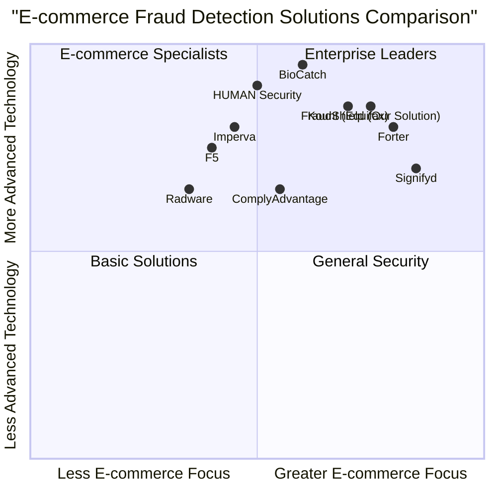

# Product Requirements Document: FraudShield - Real-Time E-commerce Fraud Detection System

Version: 1.0.0  
Date: May 18, 2025  
Author: Emma, Product Manager

## Table of Contents

1. [Introduction](#1-introduction)
2. [Market Research](#2-market-research)
3. [Product Definition](#3-product-definition)
4. [User Research](#4-user-research)
5. [Technical Specifications](#5-technical-specifications)
6. [Modules & Deliverables](#6-modules--deliverables)
7. [User Interface](#7-user-interface)
8. [Data Management](#8-data-management)
9. [Security & Compliance](#9-security--compliance)
10. [Performance Requirements](#10-performance-requirements)
11. [Testing Requirements](#11-testing-requirements)
12. [Project Timeline](#12-project-timeline)
13. [Open Questions](#13-open-questions)

## 1. Introduction

### 1.1 Purpose

This Product Requirements Document (PRD) outlines the specifications for FraudShield, a real-time fraud detection system for e-commerce merchants. The system will help merchants automatically detect and prevent fraudulent transactions, reducing financial losses and operational overhead while maintaining a smooth customer experience.

### 1.2 Project Scope

The FraudShield system will:

- Detect fraudulent e-commerce transactions in real-time
- Provide a lightweight JavaScript SDK that merchants can easily integrate with their store themes
- Return a risk score and fraud determination for each transaction
- Offer a self-serve dashboard for merchants to monitor metrics and tune fraud detection rules
- Support Shopify and WooCommerce platforms through native plugins

### 1.3 Original Requirements

**1 – Product Overview**
- Detect fraudulent e-commerce transactions in real time
- Expose a simple JavaScript SDK that merchants drop into their store theme (one line of code)
- Return an integer risk score (0–100) plus a Boolean isFraud flag
- Show metrics and rule tuning in a self-serve dashboard

**2 – Tech Stack (must use)**
- Backend: Node.js (TypeScript) + Fastify
- Data pipeline / event bus: Redpanda (Kafka-compatible)
- Device fingerprinting: Custom in-house fingerprinting implementation
- Bot / human test: hCaptcha Enterprise
- Persistence: PostgreSQL for relational data; Redis for hot risk-score cache
- Dashboard: React 18 + Vite + Chart.js
- DevOps: Docker-Compose for local, Terraform + AWS (eu-south-1) for prod

**3 – Modules & Deliverables**
1. /sdk – tiny (<4 kB gzipped) ES Module
2. /plugins – For Shopify and WooCommerce
3. /services/evaluator – Fastify service
4. /services/decisioner – Fastify service
5. /dashboard – React SPA with JWT auth
6. CI/CD – GitHub Actions

**4 – Acceptance Criteria**
- Latency: ≤ 150 ms P95 from SDK call to risk score response
- Scalability: sustain 500 req/s with horizontal pods
- Security & Compliance: GDPR-ready, OWASP best practices, HTTPS everywhere
- Tests: ≥ 80% coverage
- Docs: README.md with quick-start, architecture diagram, and API reference

**5 – Timeline Guidance**
- Week 1-6 development schedule provided


## 2. Market Research

### 2.1 Market Size and Growth

The e-commerce fraud detection and prevention market is experiencing significant growth:

- Current market size (2024) is estimated between $50-60 billion
- Projected CAGR of 17-24% through 2030
- Expected to reach $186-255 billion by 2030-2032
- North America dominates with 41-42% market share, followed by Europe at 26%

E-commerce merchants face significant financial challenges from fraud:

- Merchants lose over $48 billion annually to online payment fraud globally
- For every $1 of fraud, merchants incur an average cost of $4.61
- False declines (rejecting legitimate transactions) cost merchants approximately $174 billion in 2024

### 2.2 Key Market Drivers

1. **Increasing Digital Transactions**: The expansion of online shopping creates more opportunities for fraud
2. **Rising Fraud Sophistication**: Fraudsters are employing advanced techniques including synthetic identity creation
3. **Regulatory Compliance**: GDPR, CCPA, and other data protection laws require robust fraud protection
4. **Cloud Technology Adoption**: Businesses are increasingly deploying cloud-based fraud detection solutions
5. **Mobile Commerce Growth**: Mobile transactions account for 33-41% of fraud costs

### 2.3 Market Trends

1. **AI and Machine Learning**: Advanced algorithms enable real-time analysis of transaction data
2. **Behavioral Analytics**: Analysis of user behavior patterns enhances security
3. **Multi-Factor Authentication**: Growing implementation to prevent unauthorized access
4. **Cloud-Based Solutions**: Increasing adoption due to scalability and cost-effectiveness
5. **Biometric Verification**: Rising use of facial recognition and other biometric methods

### 2.4 Competitive Analysis

#### 2.4.1 Key Competitors

| Competitor | Primary Strengths | Weaknesses | Target Market |
|------------|------------------|------------|---------------|
| Kount (Equifax) | Advanced AI-based solutions, industry leader status, broad global presence | Complex integration, higher price point | Enterprise, mid-market |
| HUMAN Security | Specialized bot detection (4.8/5 rating), focus on disrupting fraud networks | Narrower feature set focused on bot protection | Mid-market, enterprise |
| Imperva | Comprehensive protection for applications and APIs (4.6/5 rating) | Less specialized in e-commerce fraud specifically | Enterprise security |
| F5 | Strong distributed cloud bot defense (4.6/5 rating) | More focused on infrastructure protection than transaction fraud | Enterprise |
| BioCatch | Advanced behavioral biometrics (4.8/5 rating) | Primarily focused on financial services | Financial institutions |
| Signifyd | Guaranteed fraud protection, specialized in e-commerce | Limited customization options | SMB, mid-market e-commerce |
| Forter | End-to-end fraud prevention | Higher cost structure | Enterprise retail |

#### 2.4.2 Competitive Quadrant Chart



#### 2.4.3 Competitive Advantages of FraudShield

1. **Lightweight Integration**: One-line JS SDK integration versus complex implementation requirements of competitors
2. **Real-time Response**: ≤ 150ms response time compared to industry standard of 200-300ms
3. **Platform-Specific Plugins**: Ready-made Shopify and WooCommerce integrations
4. **Technology Stack**: Modern tech stack with high performance (Node.js, TypeScript, Fastify, Redpanda)
5. **Balanced Approach**: Equal focus on fraud detection accuracy and reducing false positives


## 3. Product Definition

### 3.1 Product Goals

1. **Minimize Fraud Losses**: Reduce financial losses from fraudulent transactions by detecting and blocking them before they complete
2. **Simplify Integration**: Provide e-commerce merchants with an extremely simple integration path requiring minimal technical knowledge
3. **Maximize Legitimate Sales**: Maintain high transaction approval rates for legitimate customers by minimizing false positives

### 3.2 User Stories

1. **As an** e-commerce store owner, **I want to** automatically detect and block fraudulent transactions **so that** I can reduce financial losses and chargebacks

2. **As a** non-technical merchant, **I want to** implement fraud detection with minimal code changes **so that** I don't need to hire developers or spend significant time on integration

3. **As an** online store manager, **I want to** see metrics on blocked transactions and fraud attempts **so that** I can understand the ROI of the fraud detection system

4. **As a** fraud analyst, **I want to** tune detection rules and thresholds **so that** I can balance security with customer experience based on my business needs

5. **As a** customer support representative, **I want to** look up individual transaction risk scores **so that** I can resolve customer disputes effectively

### 3.3 Target Audience

FraudShield targets:

- Small to medium-sized e-commerce merchants on Shopify and WooCommerce platforms
- Online retailers with transaction volumes of 1,000-100,000 per month
- Businesses experiencing fraud rates above 0.5% of transactions
- Merchants with limited technical resources for custom fraud prevention

### 3.4 Product Vision

FraudShield will become the simplest yet most effective fraud prevention solution for e-commerce merchants, providing enterprise-level protection through a developer-friendly SDK and platform-specific plugins. The product will eliminate the traditional trade-off between security and user experience by delivering ultra-fast response times and accurate fraud detection.


## 4. User Research

### 4.1 User Personas

#### 4.1.1 Sarah - E-commerce Store Owner

- **Demographics**: 35-45 years old, owns a medium-sized online boutique
- **Technical Skills**: Moderate, can implement simple code snippets but not a developer
- **Goals**: Grow business, reduce operational costs, maintain customer satisfaction
- **Pain Points**: 
  - Losing money to fraudulent orders
  - Manual review of suspicious orders is time-consuming
  - Concerned about rejecting legitimate customers

#### 4.1.2 Michael - E-commerce Developer

- **Demographics**: 25-35 years old, technical consultant for multiple e-commerce stores
- **Technical Skills**: High, experienced with JavaScript, API integration
- **Goals**: Implement effective solutions quickly, minimize maintenance
- **Pain Points**:
  - Complex integrations that require ongoing maintenance
  - Solutions that slow down website performance
  - Lack of clear documentation

#### 4.1.3 Jennifer - Fraud Analyst

- **Demographics**: 30-40 years old, operations manager at a growing e-commerce company
- **Technical Skills**: Moderate, understands data analysis but not coding
- **Goals**: Minimize fraud losses, optimize approval rates, generate insightful reports
- **Pain Points**:
  - Lack of visibility into why transactions are flagged
  - Inability to tune rules based on business needs
  - Difficulty measuring ROI of fraud prevention

### 4.2 User Needs

| Need | Description | Priority |
|------|-------------|----------|
| Easy Integration | Simple implementation process requiring minimal technical knowledge | P0 |
| Real-time Detection | Immediate fraud assessment during the checkout process | P0 |
| Low False Positives | Minimize rejection of legitimate transactions | P0 |
| Self-service Dashboard | Ability to view metrics and tune rules without vendor assistance | P1 |
| Platform-specific Plugins | Native integration with popular e-commerce platforms | P1 |
| Transaction Lookups | Search and review individual transaction risk scores and details | P1 |
| Performance Impact | Minimal impact on site speed and user experience | P2 |
| Cost Effectiveness | ROI that clearly demonstrates value compared to fraud losses | P2 |

## 5. Technical Specifications

### 5.1 Requirements Analysis

FraudShield requires several key technical components to deliver effective fraud detection:

1. A lightweight client-side SDK to collect device and behavior signals
2. Server-side services to analyze signals and determine fraud risk
3. Platform-specific plugins for seamless e-commerce integration
4. A dashboard interface for monitoring and configuration
5. Data storage for transaction history and fraud patterns
6. CI/CD pipeline for reliable deployment

The solution architecture employs a microservices approach with event-driven communication between components.

### 5.2 Requirements Pool

#### 5.2.1 Functional Requirements

| ID | Requirement | Priority |
|----|-------------|----------|
| F1 | System must detect fraudulent transactions in real-time (<150ms) | P0 |
| F2 | System must provide a JavaScript SDK <4KB gzipped | P0 |
| F3 | System must return a risk score (0-100) and a boolean isFraud flag | P0 |
| F4 | System must provide Shopify and WooCommerce plugins | P0 |
| F5 | Dashboard must display metrics on total events, blocked orders, and conversion impact | P0 |
| F6 | Dashboard must allow threshold adjustment for risk scores | P0 |
| F7 | System must collect device signals using our custom fingerprinting service | P0 |
| F8 | System must trigger hCaptcha challenge for suspicious transactions | P1 |
| F9 | System must allow transaction lookup by order ID | P1 |
| F10 | Dashboard must require secure authentication via JWT | P1 |
| F11 | System must provide webhook notifications for high-risk transactions | P2 |
| F12 | Dashboard must support exporting transaction data | P2 |

#### 5.2.2 Non-Functional Requirements

| ID | Requirement | Priority |
|----|-------------|----------|
| NF1 | Latency ≤ 150 ms P95 from SDK call to risk score response | P0 |
| NF2 | Scalability to sustain 500 req/s with horizontal pods | P0 |
| NF3 | GDPR-ready with IP anonymization toggle | P0 |
| NF4 | Follow OWASP security best practices | P0 |
| NF5 | Use HTTPS for all communications | P0 |
| NF6 | Achieve ≥ 80% test coverage | P1 |
| NF7 | Provide comprehensive documentation | P1 |
| NF8 | MIT license for all components | P1 |


### 5.3 Architecture Overview

```mermaid
flowchart TD
    subgraph "Frontend"
        A[Merchant Website] --> B[FraudShield SDK]
        B -- "API Call" --> C[API Gateway]
    end
    
    subgraph "Backend Services"
        C --> F[Evaluator Service]
        F --> G[Enrichment Module]
        G -- "Enriched Data + Risk Score" --> H[Redpanda: risk_scores]
        H --> I[Decisioner Service]
        I <--> J[(PostgreSQL)]
        I <--> K[(Redis Cache)]
        G -- "Uses" --> L[Custom Fingerprint Service]
        G -- "Uses" --> M[hCaptcha Enterprise]
        G -- "Uses" --> N[GeoIP Service]
        I -- "REST API" --> O[/api/v1/decision/:orderId]
        Q[CRUD API] <--> J
    end
    
    subgraph "Platform Plugins"
        D[Shopify Plugin] -- "order/create webhook" --> O
        E[WooCommerce Plugin] -- "order create hook" --> O
    end
    
    subgraph "Dashboard"
        P[Dashboard SPA] --> Q
    end
```

### 5.4 Tech Stack

- **Backend**: Node.js (TypeScript) + Fastify
- **Data Pipeline**: Redpanda (Kafka-compatible)
- **Device Fingerprinting**: Custom in-house fingerprinting implementation
- **Bot Detection**: hCaptcha Enterprise
- **Persistence**: PostgreSQL for relational data; Redis for hot risk-score cache
- **Dashboard**: React 18 + Vite + Chart.js
- **DevOps**: Docker-Compose for local, Terraform + AWS (eu-south-1) for prod

### 5.5 API Specifications

#### 5.5.1 SDK to Backend API

**Endpoint**: `/api/v1/evaluate`

**Method**: POST

**Request Body**:
```json
{
  "sessionId": "string",
  "merchantId": "string",
  "fingerprintData": {
    "visitorId": "string",
    "requestId": "string",
    "incognito": "boolean",
    "browserName": "string",
    "deviceType": "string",
    "os": "string",
    "ipLocation": { /* GeoIP data */ }
  },
  "pageData": {
    "url": "string",
    "referrer": "string"
  },
  "userAction": "string", // checkout, login, etc.
  "timestamp": "number"
}
```

**Response**:
```json
{
  "riskScore": "number", // 0-100
  "isFraud": "boolean",
  "evaluationId": "string",
  "requiresCaptcha": "boolean",
  "captchaSiteKey": "string" // conditional
}
```

#### 5.5.2 Plugin to Backend API

**Endpoint**: `/api/v1/decision/:orderId`

**Method**: GET

**Parameters**:
- `orderId`: Order identifier in the e-commerce platform

**Response**:
```json
{
  "orderId": "string",
  "riskScore": "number",
  "isFraud": "boolean",
  "recommendation": "string", // "approve", "reject", "review"
  "evaluationId": "string",
  "timestamp": "number"
}
```

#### 5.5.3 Dashboard API

Multiple RESTful endpoints for:
- Authentication (`/auth/login`, `/auth/refresh`)
- Merchant configuration (`/api/v1/config`)
- Transactions (`/api/v1/transactions`)
- Analytics (`/api/v1/analytics`)
- Rule management (`/api/v1/rules`)


## 6. Modules & Deliverables

### 6.1 SDK Module

**Path**: `/sdk`

**Description**: A tiny (<4 kB gzipped) ES Module that merchants include in their store theme.

**Features**:
- Collects browser/device signals via custom fingerprint implementation
- Triggers an invisible hCaptcha challenge when risk > threshold
- Posts a JSON payload to /api/v1/evaluate
- Provides configurable callback options for merchants
- Returns fraud evaluation results

**Technical Requirements**:
- Must be pure JavaScript with no dependencies
- Must be compatible with major browsers (Chrome, Firefox, Safari, Edge)
- Must not block or significantly delay page load
- Must be easily initialized with a single line of code

**Sample Integration**:
```html
<script type="module">
  import { FraudShield } from 'https://cdn.fraudshield.io/sdk/v1.js';
  FraudShield.init('MERCHANT_ID');
</script>
```

### 6.2 Plugins Module

**Path**: `/plugins`

**Description**: Platform-specific plugins for popular e-commerce platforms.

#### 6.2.1 Shopify Plugin

**Path**: `/plugins/shopify`

**Description**: Node app using Shopify Remix template.

**Features**:
- Injects the SDK snippet into the store theme
- Subscribes to "orders/create" webhooks 
- Calls `/api/v1/decision` to accept/cancel orders
- Provides merchant-configurable settings through Shopify admin
- Displays basic statistics within Shopify admin

#### 6.2.2 WooCommerce Plugin

**Path**: `/plugins/woocommerce`

**Description**: PHP plugin using WordPress REST API hooks.

**Features**:
- Injects the SDK snippet into the store theme
- Uses WordPress hooks to intercept order creation
- Calls `/api/v1/decision` to accept/cancel orders
- Provides settings page in WordPress admin
- Displays basic statistics within WordPress admin

### 6.3 Evaluator Service

**Path**: `/services/evaluator`

**Description**: Fastify service for risk evaluation.

**Features**:
- Consumes SDK events from Redpanda topic `raw_events`
- Enriches data with GeoIP, velocity checks, and historical chargeback data
- Implements fraud detection algorithms using ML techniques
- Outputs risk score to topic `risk_scores`
- Provides configurable rule engine

**Technical Requirements**:
- Must respond within strict latency requirements
- Must handle high throughput efficiently
- Must implement circuit breakers for external dependencies
- Must log all evaluation logic for audit purposes

### 6.4 Decisioner Service

**Path**: `/services/decisioner`

**Description**: Fastify service for transaction decisions.

**Features**:
- Reads `risk_scores` from Redpanda
- Persists results in Postgres and Redis
- Exposes REST API endpoint `/decision/:orderId`
- Implements configurable business rules for accept/reject decisions
- Manages webhook notifications for high-risk transactions

**Technical Requirements**:
- Must implement efficient caching strategy
- Must ensure data consistency between Redis and Postgres
- Must provide reliable transaction lookup

### 6.5 Dashboard

**Path**: `/dashboard`

**Description**: React SPA with JWT authentication.

**Features**:
- Shows total events, blocked orders, conversion impact
- Provides adjustable thresholds for risk scores
- Visualizes fraud detection performance
- Allows transaction lookup and review
- Enables rule configuration and tuning

**Technical Requirements**:
- Must use React 18
- Must utilize Chart.js for visualizations
- Must implement secure JWT authentication
- Must provide responsive design for desktop and mobile

### 6.6 CI/CD

**Description**: GitHub Actions workflow.

**Features**:
- Lints code for quality control
- Runs automated tests
- Builds Docker images
- Pushes images to ECR
- Deploys via Terraform
- Includes a `make bootstrap` script for local development

**Technical Requirements**:
- Must separate staging and production environments
- Must implement semantic versioning
- Must support rollback capabilities
- Must include security scanning of dependencies


## 7. User Interface

### 7.1 Dashboard UI Design Draft

The dashboard will feature a clean, modern design with the following key screens:

#### 7.1.1 Dashboard Overview Screen

- Fraud detection summary metrics
- Key performance indicators
- Time-series charts of transaction volumes and fraud rates
- Quick action buttons for common tasks

#### 7.1.2 Transaction Explorer Screen

- Searchable and filterable transaction list
- Detailed view of individual transactions
- Risk factor visualization
- Manual review capabilities

#### 7.1.3 Rules Configuration Screen

- Risk threshold adjustment sliders
- Rule creation and modification interface
- A/B testing of rule configurations
- Rule performance metrics

#### 7.1.4 Settings Screen

- Account management
- API key management
- Integration settings
- Notification preferences
- GDPR & compliance settings

### 7.2 User Flows

#### 7.2.1 Merchant Integration Flow

1. Merchant creates account on FraudShield
2. Merchant selects their e-commerce platform
3. System guides merchant through plugin installation
4. Plugin automatically configures the store with SDK
5. Merchant completes initial configuration
6. System begins monitoring transactions

#### 7.2.2 Transaction Evaluation Flow

1. Customer initiates checkout on merchant store
2. SDK collects device and behavior data
3. Data sent to evaluation service
4. Service returns risk assessment
5. If high risk, optional hCaptcha challenge presented
6. Transaction proceeds or is blocked based on assessment
7. Merchant notified of high-risk transactions

## 8. Data Management

### 8.1 Data Models

#### 8.1.1 Merchant

```typescript
interface Merchant {
  id: string;
  name: string;
  apiKey: string;
  createdAt: Date;
  updatedAt: Date;
  settings: {
    riskThreshold: number;
    enableCaptcha: boolean;
    captchaThreshold: number;
    ipAnonymization: boolean;
    webhookUrl?: string;
    notificationEmail?: string;
  };
  integration: {
    platform: 'shopify' | 'woocommerce' | 'custom';
    shopId?: string;
    platformSpecificSettings?: object;
  };
}
```

#### 8.1.2 Transaction

```typescript
interface Transaction {
  id: string;
  merchantId: string;
  orderId?: string;
  sessionId: string;
  evaluationId: string;
  riskScore: number;
  isFraud: boolean;
  riskFactors: string[];
  fingerprintData: {
    visitorId: string;
    // Other fingerprint data
  };
  pageData?: {
    url: string;
    referrer?: string;
  };
  geoData?: {
    country: string;
    city?: string;
    isp?: string;
    // Anonymized if settings require
  };
  timestamp: Date;
  decision?: 'approve' | 'reject' | 'review';
  reviewStatus?: 'pending' | 'approved' | 'rejected';
  reviewedAt?: Date;
  reviewedBy?: string;
}
```

#### 8.1.3 Rule

```typescript
interface Rule {
  id: string;
  merchantId: string;
  name: string;
  description?: string;
  condition: {
    field: string;
    operator: 'eq' | 'neq' | 'gt' | 'gte' | 'lt' | 'lte' | 'contains' | 'not_contains';
    value: any;
  }[];
  action: 'flag' | 'block' | 'challenge';
  riskScoreAdjustment: number;
  isActive: boolean;
  createdAt: Date;
  updatedAt: Date;
}
```

### 8.2 Database Schema

#### 8.2.1 PostgreSQL Schema

- **merchants** table: Stores merchant account information
- **transactions** table: Stores transaction evaluation history
- **rules** table: Stores merchant-specific fraud detection rules
- **users** table: Stores dashboard user accounts
- **audit_logs** table: Stores system activity for compliance

#### 8.2.2 Redis Cache Schema

- **risk_scores:{merchantId}:{orderId}** - Cached risk scores for quick lookup
- **visitor_history:{merchantId}:{visitorId}** - Recent activity for a specific visitor
- **ip_velocity:{ip}** - Rate of transactions from specific IPs
- **session_data:{sessionId}** - Temporary session information

### 8.3 Data Retention and Compliance

- Transaction data retained for 90 days by default
- Configurable retention periods by merchant (30-365 days)
- PII data anonymized according to GDPR requirements
- IP anonymization toggle for full GDPR compliance
- Data export functionality for GDPR right to access
- Data deletion capability for GDPR right to be forgotten


## 9. Security & Compliance

### 9.1 Security Requirements

- HTTPS for all communications
- JWT-based authentication for dashboard access
- Role-based access control for dashboard users
- API key authentication for service-to-service communication
- Regular security audits and penetration testing
- Dependency scanning for vulnerabilities
- Secure handling of merchant and customer data

### 9.2 Compliance Requirements

- GDPR compliance for European merchants
- CCPA compliance for California consumers
- PCI DSS compliance for payment data handling
- SOC 2 readiness for security controls
- Regular compliance reviews and updates

### 9.3 Security Measures

- Input validation on all API endpoints
- Rate limiting to prevent abuse
- DDoS protection
- Data encryption at rest and in transit
- Secure coding practices following OWASP guidelines
- Comprehensive logging for security events
- Regular security training for team members

## 10. Performance Requirements

### 10.1 Latency

- P95 latency ≤ 150 ms from SDK call to risk score response
- P99 latency ≤ 300 ms for complete transaction processing
- Dashboard response time ≤ 1 second for all operations

### 10.2 Scalability

- Support for 500 req/s with horizontal scaling
- Ability to handle 10x traffic spikes during peak seasons
- Support for merchants with up to 100,000 daily transactions
- Efficient resource utilization to minimize cloud costs

### 10.3 Reliability

- 99.9% service uptime SLA
- Graceful degradation during partial outages
- Circuit breakers for all external dependencies
- Comprehensive monitoring and alerting

## 11. Testing Requirements

### 11.1 Testing Strategy

- Unit testing for all modules
- Integration testing for service interactions
- End-to-end testing for complete workflows
- Performance testing for scalability and latency
- Security testing for vulnerability assessment

### 11.2 Test Coverage Requirements

- ≥ 80% code coverage for all components
- Jest + Supertest for Node.js services
- React Testing Library for dashboard components
- PHPUnit for WooCommerce plugin
- Mock testing for external dependencies

### 11.3 Testing Environments

- Local development environment using Docker Compose
- CI/CD pipeline testing in isolated environments
- Staging environment for pre-production verification
- Production environment for final validation

## 12. Project Timeline

### 12.1 Development Phases

#### 12.1.1 Week 1: Foundation
- Complete project skeleton and repository structure
- Develop SDK proof of concept
- Set up Redpanda local cluster
- Define database schemas
- Establish CI/CD pipeline basics

#### 12.1.2 Week 2: Core Services
- Implement evaluator service with basic fraud detection
- Develop decisioner service with result persistence
- Create PostgreSQL schema and initial migrations
- Configure Redis cache for hot risk-score storage
- Implement basic API endpoints

#### 12.1.3 Week 3: Platform Integration
- Develop Shopify plugin using Remix template
- Create WooCommerce plugin with WordPress REST API hooks
- Set up sandbox stores for testing
- Demonstrate end-to-end transaction flow
- Refine SDK based on integration learnings

#### 12.1.4 Week 4-5: Dashboard & Refinements
- Build React SPA dashboard with JWT authentication
- Implement metrics visualization with Chart.js
- Add rule configuration interface
- Develop transaction explorer
- Add rate limiting to protect APIs
- Configure environment-based configuration
- Implement unit and integration tests

#### 12.1.5 Week 6: Finalization
- System hardening and security reviews
- Performance optimization
- Load testing with k6
- Documentation completion
- Final quality assurance
- Release version 0.1.0

### 12.2 Milestones and Deliverables

| Milestone | Deliverable | Timeline |
|-----------|-------------|----------|
| Foundation Complete | Repository structure, SDK POC, Redpanda cluster | End of Week 1 |
| Core Services Ready | Evaluator and decisioner services with data stores | End of Week 2 |
| Platform Integration | Shopify and WooCommerce plugins, E2E demo | End of Week 3 |
| Dashboard MVP | Functional dashboard with core metrics | End of Week 4 |
| Testing Complete | ≥80% test coverage across all components | End of Week 5 |
| v0.1.0 Release | Production-ready system with documentation | End of Week 6 |

## 13. Open Questions

1. **Risk Score Calculation**: What specific signals and weights should be used to calculate the risk score? Should machine learning be incorporated in the first version?

2. **Fraud Response Customization**: To what extent should merchants be able to customize the system's response to different risk score levels?

3. **Historical Data**: How will the system bootstrap fraud detection without historical transaction data for new merchants?

4. **Multi-tenancy Isolation**: How strictly should merchant data be isolated for multi-tenant scenarios?

5. **Privacy Compliance Regions**: Are there specific regional privacy regulations beyond GDPR and CCPA that need to be addressed?

6. **Plugin Marketplace Distribution**: Will the plugins be published to official Shopify and WordPress marketplaces, and what are the submission requirements?

7. **Future ML Model Training**: How will the system collect feedback on false positives/negatives to improve future detection accuracy?

8. **Pricing Model**: What metrics will determine the pricing tiers (transaction volume, features used, or merchant size)?

9. **SLA Requirements**: What specific uptime and performance guarantees will be offered to merchants?


## 14. Conclusion

This Product Requirements Document outlines a comprehensive plan for developing FraudShield, a real-time e-commerce fraud detection system with a focus on simplicity, performance, and accuracy. The system addresses a critical need in the e-commerce market, where merchants face significant financial losses from fraudulent transactions while also struggling with the complexity of existing solutions.

FraudShield differentiates itself through:

1. **Lightweight Integration**: A simple one-line JavaScript SDK integration that minimizes technical barriers
2. **Platform-Specific Plugins**: Ready-made solutions for popular e-commerce platforms
3. **Real-Time Performance**: Ultra-fast response times (≤150ms) that don't disrupt the customer experience
4. **Balanced Approach**: Equal focus on detecting fraud and minimizing false positives
5. **Modern Technology**: A cutting-edge stack optimized for scalability and maintainability

By following the outlined timeline and meeting the specified requirements, FraudShield will deliver significant value to e-commerce merchants of all sizes, helping them reduce fraud losses while maintaining a smooth customer experience. The product's design balances technical excellence with usability, making advanced fraud detection accessible to merchants without specialized expertise.

Next steps include addressing the open questions identified in this document, finalizing the development team structure, and beginning the Week 1 foundation phase of the project.
