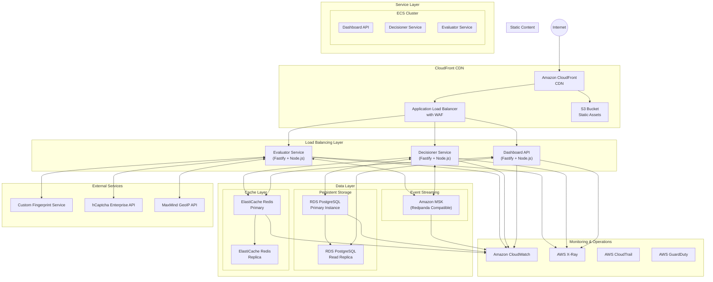

# FraudShield AWS Infrastructure Design

## Overview

This document outlines the AWS infrastructure design for the FraudShield fraud detection platform. The architecture is designed to be highly available, scalable, and secure, meeting the performance requirements of processing 500 requests per second with a P95 latency of ≤ 150ms.

## AWS Region

As specified in the requirements, the infrastructure will be deployed in the **eu-south-1** (Milan, Italy) region. This region provides good coverage for European merchants while helping meet GDPR compliance requirements.

## Infrastructure Diagram



## Component Details

### Network Infrastructure

1. **VPC Configuration**
   - A dedicated VPC with public and private subnets across 3 Availability Zones
   - Public subnets for the load balancers
   - Private subnets for the ECS services, RDS, and ElastiCache
   - NAT Gateways in each public subnet for outbound traffic from private subnets
   - VPC Flow Logs enabled and sent to CloudWatch Logs

2. **Security Groups**
   - Load Balancer SG: Allows inbound HTTP/HTTPS from the internet
   - Application SG: Allows traffic only from the Load Balancer SG
   - Database SG: Allows traffic only from the Application SG
   - Cache SG: Allows traffic only from the Application SG
   - Redpanda SG: Allows traffic only from the Application SG

### Application Delivery

1. **CloudFront CDN**
   - Distributes static assets from S3 (SDK, dashboard assets)
   - Edge caching for improved global performance
   - HTTPS enforcement with custom SSL certificate
   - DDoS protection

2. **Application Load Balancer**
   - Routes traffic to appropriate services based on URL paths
   - Integrated with AWS WAF for additional security
   - Health checks to ensure service availability
   - SSL termination

3. **S3 Bucket for Static Content**
   - Stores JavaScript SDK, dashboard frontend assets
   - Versioned for rollback capability
   - CloudFront origin access identity for security

### Compute Resources

1. **ECS Cluster with Fargate**
   - Serverless container management
   - Auto-scaling based on CPU/memory utilization and request count
   - Task definitions for each service with appropriate resource allocations

2. **Service Containers**
   - Evaluator Service: Processes raw events and calculates risk scores
   - Decisioner Service: Makes final fraud decisions and exposes decision API
   - Dashboard API: Provides interfaces for the merchant dashboard

### Data Storage

1. **Amazon RDS for PostgreSQL**
   - Multi-AZ deployment for high availability
   - Read replicas for improved read performance
   - Automated backups and point-in-time recovery
   - Performance insights enabled for monitoring

2. **Amazon ElastiCache for Redis**
   - Redis Cluster mode for scalability
   - Multi-AZ with automatic failover
   - In-memory data store for high-speed caching
   - Encryption at rest and in transit

3. **Amazon Managed Streaming for Kafka (MSK)**
   - Compatible with Redpanda clients
   - Multi-AZ deployment for high availability
   - Auto-scaling capabilities
   - Encryption at rest and in transit

### Security

1. **AWS WAF**
   - Web Application Firewall integrated with CloudFront and ALB
   - Protection against OWASP Top 10 vulnerabilities
   - Rate limiting to prevent abuse
   - IP reputation lists to block known bad actors

2. **AWS Shield**
   - DDoS protection
   - Layer 3 and Layer 4 attack mitigation

3. **AWS Secrets Manager**
   - Secure storage for database credentials
   - API keys for hCaptcha and GeoIP services
   - Automatic rotation of secrets

4. **AWS IAM**
   - Principle of least privilege access control
   - Role-based access for services
   - MFA enforcement for human users

### Monitoring and Operations

1. **Amazon CloudWatch**
   - Metrics, logs, and alarms
   - Custom dashboards for service health
   - Log aggregation from all services
   - Anomaly detection for early warning

2. **AWS X-Ray**
   - Distributed tracing for performance monitoring
   - Request visualization to identify bottlenecks
   - Service map to understand dependencies

3. **Amazon CloudTrail**
   - Auditing of all API calls
   - Compliance monitoring
   - Security analysis

4. **AWS GuardDuty**
   - Threat detection service
   - Continuous monitoring for malicious activity
   - Integrated with CloudWatch Events for automated response

## Deployment Strategy

### Infrastructure as Code

1. **Terraform**
   - All infrastructure defined as code
   - Version controlled in Git repository
   - Modular design for reusability
   - Environment separation (dev, staging, prod)

2. **CI/CD Pipeline (AWS CodePipeline)**
   - Automated testing of infrastructure changes
   - Multiple environments for testing changes
   - Approval gates for production deployments

### Auto Scaling

1. **ECS Service Auto Scaling**
   - Target tracking policies based on CPU utilization (70%)
   - Target tracking based on request count
   - Scheduled scaling for predictable load patterns

2. **Database and Cache Scaling**
   - Vertical scaling for database instances
   - Read replicas for read scaling
   - ElastiCache node type scaling based on monitoring

## High Availability and Disaster Recovery

1. **Multi-AZ Deployments**
   - All critical services deployed across 3 Availability Zones
   - Automatic failover for database and cache

2. **Backup Strategy**
   - Automated daily backups of RDS with 30-day retention
   - S3 versioning for static assets
   - Database snapshots before major changes

3. **Disaster Recovery Plan**
   - Recovery Time Objective (RTO): 1 hour
   - Recovery Point Objective (RPO): 15 minutes
   - Regular DR drills to validate procedures

## Compliance Considerations

1. **GDPR Compliance**
   - Data stored in EU region (eu-south-1)
   - IP anonymization toggle implemented at application level
   - Data retention policies enforced in application logic

2. **Security Compliance**
   - HTTPS everywhere
   - Regular security scans
   - Vulnerability monitoring
   - PCI DSS considerations for payment-adjacent systems

## Cost Optimization

1. **Reserved Instances**
   - 1-year reservations for RDS and ElastiCache base capacity
   - On-demand instances for variable capacity

2. **Fargate Spot Instances**
   - Use Fargate Spot for non-critical processing tasks

3. **CloudFront Optimizations**
   - Appropriate cache TTLs to minimize origin requests
   - Compression enabled to reduce transfer costs

4. **Monitoring and Alerts**
   - Cost anomaly detection
   - Budget alerts
   - Resource utilization monitoring

## Deployment Process

1. **Initial Setup**
   - Network infrastructure (VPC, subnets, etc.)
   - Security configurations
   - Database and cache clusters
   - Container repositories

2. **Application Deployment**
   - Database schema migration
   - Service deployment via ECS
   - CloudFront distribution setup

3. **Testing and Validation**
   - Load testing to verify performance requirements
   - Security scanning and penetration testing
   - Failover testing for high availability

## Local Development Environment

The local development environment will use Docker Compose to mirror the production services:

```yaml
# docker-compose.yml excerpt
version: '3.8'

services:
  evaluator:
    build: ./services/evaluator
    ports:
      - "3001:3001"
    environment:
      - NODE_ENV=development
      - REDPANDA_BROKERS=redpanda:9092
      - REDIS_HOST=redis
    depends_on:
      - redpanda
      - redis

  decisioner:
    build: ./services/decisioner
    ports:
      - "3002:3002"
    environment:
      - NODE_ENV=development
      - REDPANDA_BROKERS=redpanda:9092
      - POSTGRES_HOST=postgres
      - REDIS_HOST=redis
    depends_on:
      - redpanda
      - postgres
      - redis

  dashboard-api:
    build: ./services/dashboard-api
    ports:
      - "3003:3003"
    environment:
      - NODE_ENV=development
      - POSTGRES_HOST=postgres
      - REDIS_HOST=redis
    depends_on:
      - postgres
      - redis

  dashboard-ui:
    build: ./dashboard
    ports:
      - "3000:3000"
    environment:
      - VITE_API_URL=http://localhost:3003
    depends_on:
      - dashboard-api

  redpanda:
    image: redpandadata/redpanda:latest
    ports:
      - "9092:9092"

  postgres:
    image: postgres:14
    ports:
      - "5432:5432"
    environment:
      - POSTGRES_USER=fraudshield
      - POSTGRES_PASSWORD=devpassword
      - POSTGRES_DB=fraudshield
    volumes:
      - postgres_data:/var/lib/postgresql/data
      - ./scripts/init-db.sql:/docker-entrypoint-initdb.d/init-db.sql

  redis:
    image: redis:6
    ports:
      - "6379:6379"
    command: redis-server --appendonly yes
    volumes:
      - redis_data:/data

volumes:
  postgres_data:
  redis_data:
```

The `make bootstrap` script would set up this local environment and seed it with test data for development.